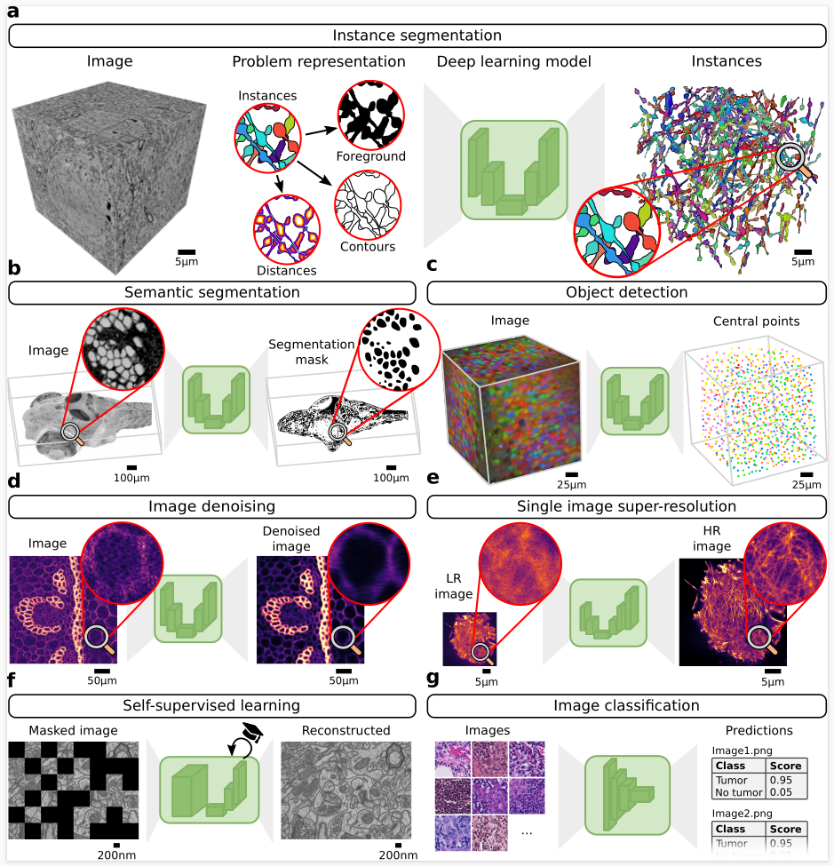

# New Galaxy Tool: BiaPy – Deep Learning for Bioimage Analysis in Galaxy

We are excited to announce that the powerful bioimage analysis toolkit **BiaPy** is now available as a fully integrated tool within Galaxy. Researchers can now perform advanced deep-learning-based workflows for image segmentation, classification, and reconstruction.
With BiaPy accessible through the Galaxy Tool Shed (version 3.6.5 + galaxy0), Galaxy users can harness BiaPy’s flexible network architectures and pretrained models from the [BioImage Model Zoo](https://bioimage.io/#/models) and [TorchVision](https://docs.pytorch.org/vision/stable/index.html) in a familiar, data-analysis-centric interface.

We encourage all Galaxy users, especially those working in microscopy, histology, cell biology, high-content screening, and spatial-omics imaging, to explore BiaPy’s capabilities, whether segmenting complex tissue structures, classifying phenotypes at scale, or reconstructing volumetric image stacks. BiaPy in Galaxy offers a new level of accessibility and reproducibility.

To get started:
1. Visit the [BiaPy tool in Galaxy](https://imaging.usegalaxy.eu/?tool_id=toolshed.g2.bx.psu.edu%2Frepos%2Fiuc%2Fbiapy%2Fbiapy%2F3.6.5%2Bgalaxy0&version=latest).
2. Learn more about BiaPy [in our documentation](https://biapyx.github.io/). Check out also the available workflows [here](https://biapy.readthedocs.io/en/latest/get_started/select_workflow.html).
3. Try a Galaxy workflow: upload an example image, run BiaPy segmentation, and link results to downstream Galaxy tools.
4. Share your workflows and feedback: join the [Galaxy Image Analysis Community in Galaxy](https://galaxyproject.org/community/sig/image-analysis/) and the [Euro-BioImaging FAIR Image Data Workflows Expert Group](https://www.eurobioimaging.eu/expert-groups/fair-image-data-workflows-expert-group/).

We look forward to seeing how the community uses BiaPy within Galaxy to push the boundaries of image-based science and reproducible research.

