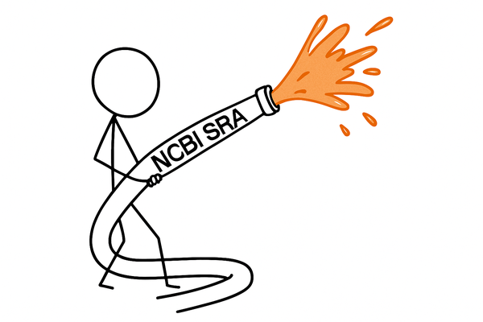

## Once upon a time I saw that paper ...

... and the paper described sequencing data (e.g., [GSE244303](https://www.ncbi.nlm.nih.gov/geo/query/acc.cgi?acc=GSE244303)). Suppose you want to download these data. The general strategy for doing this in Galaxy is:

1. Download the list of accessions from NCBI
2. Upload that list into Galaxy
3. Use Galaxy's tool for [fasterq-dump](https://usegalaxy.org/root?tool_id=toolshed.g2.bx.psu.edu/repos/iuc/sra_tools/fasterq_dump/3.1.1+galaxy1) to download the data.

## ... but, there is a better way

fasterq-dump is a good tool but sometimes it fails to download one of the accessions. And if one fails - everything fails. Instead we develop a simple workflow that allows to split your list of accessions into individual fasterq-jobs, runs them separately, and then creates two output collections: one for paired-end data and one for single-end data.

## Intrigued?

Watch this video to see how this works:

## The bottom line

Use parallel-download workflow for pulling down tens-to-hundreds of SRA datasets from NCBI SRA.

  ❗ This approach works reliably for up to a hundred SRA datasets. For downloading thousands of SRA datasets you will need a slightly different strategy. It will be shown in a subsequent blog post. 

