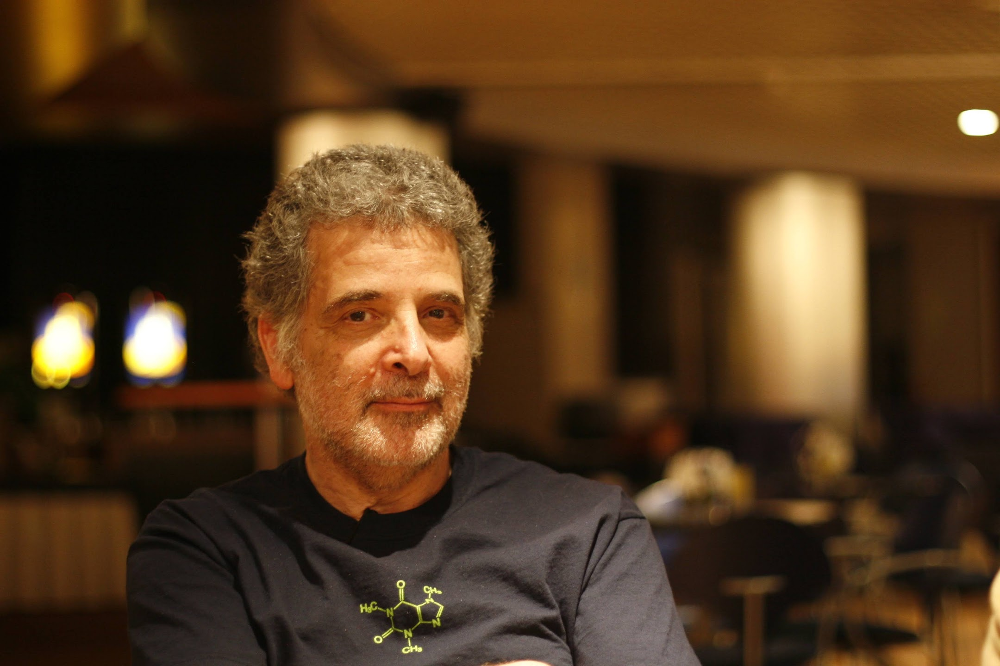
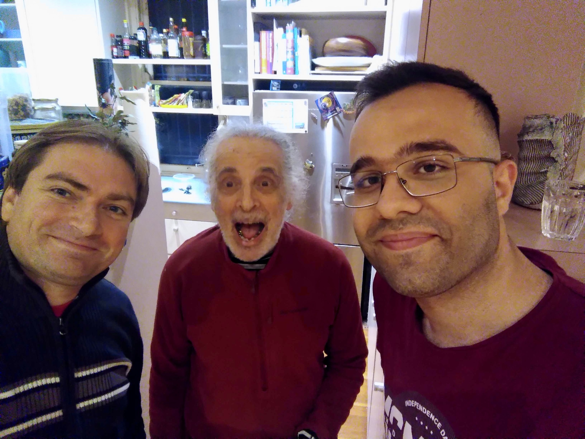

  

We lost a friend, mentor and a great human being this weekend. Ross Lazarus passed away peacefully early morning 2026-09-19.

Ross has been actively involved health informatics and bioinformatics for 40 years since graduating from the Faculty of Medicine at the University of Melbourne in 1974.
He had 12 years experience teaching undergraduate, graduate and postgraduate medicine, clincal epidemiology and public health, at the University of Sydney before moving to Harvard Medical School in 2000 where he was Director of Bioinformatics at the Channing Laboratory.

This was the time we discovered the very early version of Galaxy - back then without a workflow editor, a webapplication to run bioinformatics applications in a reproducible and transpartent way.
Ross was one of the first Galaxy power users, pushing boundaries of this new Galaxy project. But Ross was more than a user, he become quickly involved in the project, contributed tools, ideas and advice.
He become a mentor for the very young Anton Nekrutenko and his new group at Penn State University. With the advice and help of Ross the Galaxy project was able to get it first Galaxy grants and layed out the foundation of the Galaxy
project that is serving now more than 500.000 scientiests around the world.

After his stay at Harvard Medical School Ross went back to Australia and served as Head of Computational Biology at the Baker Heart and Diabetes Institute in Melbourne until 2015.
During this time the IUC was founded and Ross was one of the founding members. Witout his help and advice the IUC would not be what it is today - a community of more than 400 contributors working on more than 2000 Galaxy tools.
Ross authored and maintained a lot of computational tools, pipelines, and Galaxy wrappers, many of them still in use. For example the early RNA-Star wrapper, back then when Star was really new. The RNA Star tool in Galaxy
alone has more then 1 Million executions.

In 2015 Ross retired and enjoyd life in Bondi Beach together with Sarah and his two kids. I remember that we missed him deeply and his spot on comments and unique and always scientific humor, so we reach out and wanted to know
where we need to organise a GCC to get him back. A responded in a very funny email which he ended with:

> sorry to have drifted off but I seem to be moving out of that Galaxy and into another...

Indeed, he was swimming a lot and hiking and just enjoying life. Wonderful.

//  In 2017 we had an Admin training in Melbourne and he invited us to his place where we had a wonderful time. Learning about flying foxes and phylisophying about science.

With the sudden death of James Taylor in early 2020 the community was mourning and Ross contacted us. He knew that the loss of James would be a callange for the community and he was their to help.
We build a more sustainable community governance model and Ross was always their to advice us. During that hard time and during the Pandemic

2023 we had our first GCC in Australia and of course we invited our old friend Ross. It was so lovely to see him and Sarah again. We learned that he was battling with Cancer but recovered fully.
We also learned that we was watching the project and was very pround of it. A few Europeans stayed a a bit longer in Autralia and Ross was so kind to host us in Syndney, showing us around Bondi Beach and we could
also use his apparment in Melbourne to work closely with Galaxy Australia. He was so generouse, insightful and inspiring to many of us during this time.

And something happend :) I think he was hooked again. From that time onwards he was back online. He started to contribute to IUC again, developed tools and workflows for the VGP and other projects
and helped us building the

In terms of service to the research community, Ross has been an active open-source software developer since 1988, working with remote, often international collaborators, using specialised software engineering tools to build, distribute and support large scale research infrastructure applications. He is a member of the Galaxy (http://usegalaxy.org/) developer team.

  

